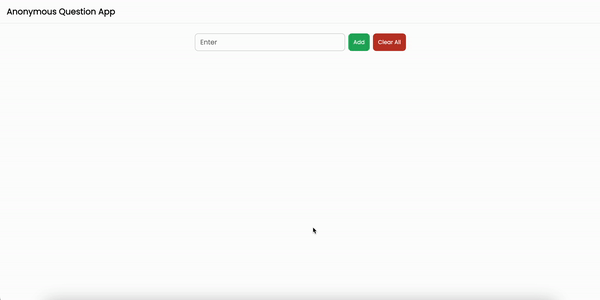

# ANONYMOUS QUESTION APP - FRONTEND

## 1. INTRODUCTION

This is the front-end repo for the `Anonymous Question App`. With the current version, the end-users can do the following things:

- Add new questions.
- View the list of questions.
- Clear all questions.

## 2. HOW TO RUN THIS REPO

- **Step 1:** We need to clone this repo from [here](https://github.com/hlestreamft/anonymous-question-app).
- **Step 2:** cd to the `client` folder.
- **Step 3:** Run `npm install`.
- **Step 4:** Run `npm run start`.

> To know how to run the back-end repo, we can refer to this [link](https://github.com/hlestreamft/anonymous-question-app/server)
